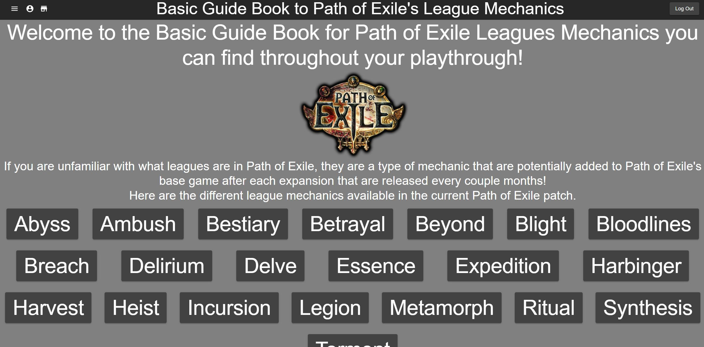

# Basic GuideBook to Path of Exile's League Mechanics

This basic CRUD Web App helps new Path of Exile players by introducing and briefly explaining some of Path of Exile's league mechanics. Some of these mechanics can be quite diffcult to understand and what they are supposed to be at a glance value. This application can help with that. Additionally, there is a marketplace that users can access to preview what other users are listing for sale. Users are required to be logged in to be able to create their own listings on the market.

## Home Page

The user can navigate through each of the pages through the menu icon at the top left or by pressing the league buttons on the home page. There is also a market button
next to the menu icon that redirects the user to the marketplace. The profile icon is not shown unless you are logged in.

## League Pages

Each league will have its own page where its basic league mechanics are briefly explained to the user. There will also be several pictures that will help visualize certain things that might be confusing.

## Marketplace

The marketplace contains all listings that other users have created to put on the market. Listings contain the type of item/service they are selling including a timestamp of when it was posted. Users will be able to contact each other with the username given on each listing, where they can message each other ingame.

## Login/Register Page

The Login and Register Page is found at the top right, where the user can create an account to participate in the marketplace. If the user has an existing account, they can login with their information. Once logged in, there will be a profile icon next to the menu icon at the top right.

## Profile Page

The Profile Page is found next to the menu icon at the top left when you are logged in. In the Profile Page you will be able to see your listings, if you have created any. You also have the option to create, delete or edit listings of your choosing.

## Starting the Web Application

1. Type "npm install" into your console to install backend packages.
2. Type "npm run server" to run the local server that stores the database.\*
3. Change Directory into the frontend and type "npm install" into the console to install all frontend packages.
4. Type "npm start" to run the Web Application.

## Notes\*

You will need to create your own local environment file (.env) that contains private information for the app to function. This should be located outside both the backend and frontend folders (same place as this current README). Additionally, you will need to create and connect your own MongoDB to access your own database. Without these the backend will not work.
